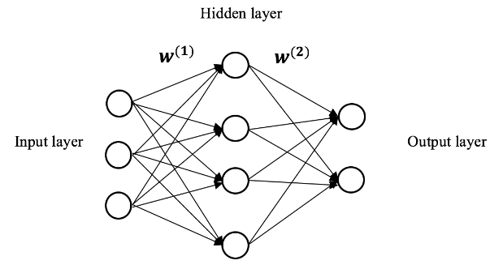

\*Si no puede visualizar correctamente este archivo, instale el paquete rmarkdown.

# Participantes

-   Ana Martín Conejo

-   Leonardo Andre Meneses Graells

-   Pablo Vázquez Vera

# Digit Recognition

En este cuaderno, vamos a crear diferentes clasificadores para un conjunto de datos basado en imagenes de 28x28 píxeles de números (del 0 al 9) escritos a mano.

El objetivo sera usar y medir la precisión de los clasificadores creados a continuación.

Primero debemos cargar todas las librerias y comprobar que tenemos todo lo necesario para proceder sin problema. Para ello ejecutaremos el siguiente codigo:

```{r}
#Comprobamos que esten instalados los paquete necesarios
if (!require("readr"))
  install.packages("readr")
if (!require("randomForest"))
  install.packages("randomForest")
if (!require(dyplr))
  install.packages("dyplr")
if (!require("DescTools"))
  + install.packages("DescTools")
if (!require("caret"))
  + install.packages("caret")
if (!require("nnet"))
  + install.packages("nnet")
if (!require("kernlab"))
  + install.packages("kernlab")
if (!require("rmarkdown"))
  + install.packages("rmarkdown")

# Libreria para leer datos de archivos
library(readr) 
# Libreria para trabajar con el modelo Random Forest
library(randomForest)
# Libraria para manejar dataframes
library(dplyr)
# Libreria para calcular la moda
library(DescTools)
# Libreria para tratar datos
library (caret)
# Libreria para calcular redes neuronales
library(nnet)
# Libreria de machine learning (SVM)
library(kernlab)
```

Ahora pasamos cargar los datos para poder realizar la pruebas pertinentes sin que debamos adaptarlos a los diferentes modelos que vamos a usar:

```{r}
#Carga el conjunto de entrenamiento
train_set <- read_csv("C:/Users/Ana/Desktop/Digit Classiffier/train.csv")
#Carga el conjunto de test
test_set <- read_csv("C:/Users/Ana/Desktop/Digit Classiffier/test.csv")
#Guardamos las clases del conjunto de entrenamiento como factor
train_labels <- as.factor(train_set[, 1]$label)
#Eliminamos la columna que incluye la clase de train set
train_set <- train_set[,-1]
#Mostramos las etiquetas de los 20 primero elementos del conjunto de entrenamiento
head(train_labels, 20)
#Mostramos cuantos datos de cada clase hay
summary(train_labels)
```

# Random Forest

En primer lugar, vamos a calcular el modelo con los datos de entrenamiento y vamos a guardarlo para poder usarlo posteriormente para predecir. En este caso, hemos usado como valor para nTree = 500, es decir, se van a expandir 500 arboles, también hemos usado la opción xtest que predecirá y almacenará las clasificaciones asignadas al conjunto de test:

```{r}
#Establecemos una semilla para crear resultados reproducibles
set.seed(123)
#Entrenamos el modelo Random forest
#rf = randomForest(formula = train_labels ~ ., data = train_set, xtest = test_set, ntree = 500)
#Guardamos el modelo de Random forest
#saveRDS(rf, "modelo_randomforest.rds")
#Cargamos el modelo de Random forest
modelo_rf = readRDS("modelo_randomforest.rds")

```

Una vez calculado y guardado el modelo, vamos a calcular la precisión (accuracy) y mostrar el error cometido en cada una de las clases que intentamos predecir. Además vamos a mostrar el descenso del error a medida que se van extendiendo los arboles:

```{r}
#Calculo del accuracy
accuracy <- (1 - mean(modelo_rf$err.rate))
print(paste("Accuracy: ",accuracy)) 

#Calculo del error por cada variable
err_df <- as.data.frame(modelo_rf$err.rate)
err_df %>%
  select(-"OOB") %>%
  colMeans()

#Error del modelo a medida que aumenta el numero de arboles
plot(modelo_rf)
#Importancia de las variables
varImpPlot(modelo_rf)
```

Ahora probamos a predecir un dato aleatorio usando el modelo calculado anteriormente y vamos a mostrar la imagen a la que corresponde dicha clasificación:

```{r}
#Elegimos un índice aleatorio de entre todos los posibles en el conjunto test
x = sample(1:nrow(test_set),1)
#Cargamos el patrón seleccionado
newdata = test_set[x,]
#Guardamos la imagen rotada
aux = matrix(tail(as.numeric(newdata), 28*28), nrow = 28, ncol = 28, byrow = TRUE)
#Desrotamos la imagen original
rotate = function(x) t(apply(x, 2, rev))
#Mostramos la imagen por pantalla
image(rotate(aux), col = grey.colors(255))
#Mostramos el índice seleccionado y la clasifiación correspondiente
modelo_rf$test$predicted[x]

```

# Single layer Network

Ahora vamos a implementar una red neuronal con una sola capa oculta, tal y como se muestra en la imagen.

{width="678"}

En nuestro caso, los parámetros elegidos son:

-   Neuronas en la capa de entrada: 784 (Número de píxeles)

-   Neuronas en la capa oculta: 50

-   Neuronas en la capa de salida(size): 10 (Número de clases)

-   Número de pesos: 784\*50 = 39760

-   Número máximo de iteraciones: 200

-   Descenso del coeficiente de aprendizaje: 0,0001

```{r}
#Entrenamos el modelo descrito arriba
#model_nn <- nnet(train_labels ~ ., data=train_set, size=50, maxit=200, MaxNWts=100000, decay=1e-4)
#Guardamos el modelo de red neuronal
#saveRDS(model_nn, "modelo_nnet.rds")
#Cargamos el modelo de red neuronal
modelo_nn = readRDS("modelo_nnet.rds")
```

Una vez calculado el modelo, pasamos a calcular su precisión (accuracy).

```{r}
prediction_nn <- predict(modelo_nn, train_set, type = "class")
accuracy_nn <- mean(prediction_nn == train_labels)
accuracy_nn
```

Ahora pasamos a predecir la etiqueta de clase según los datos del conjunto test (mismo procedimiento anterior):

```{r}
#Elegimos un índice aleatorio de entre todos los posibles en el conjunto test
y = sample(1:nrow(test_set),1)
#Cargamos el patrón seleccionado
newdata = test_set[y,]
#Guardamos la imagen rotada
aux = matrix(tail(as.numeric(newdata), 28*28), nrow = 28, ncol = 28, byrow = TRUE)
#Desrotamos la imagen original
rotate = function(x) t(apply(x, 2, rev))
#Mostramos la imagen por pantalla
image(rotate(aux), col = grey.colors(255))
#Mostramos la clasifiación correspondiente y el valor de salida de cada neurona
pred <- predict(modelo_nn, newdata)
prediction_nn <- which.max(predict(modelo_nn, newdata)) -1
prediction_nn
pred

```

# Support Vector Machine

Dado que para calcular la matriz de confusión en las máquinas soporte vector necesitamos datos con su clasifiación correspondiente, vamos a dividir el conjunto original de train en train y valid:

```{r}
#Cargamos los 5000 primeros datos del conjunto train
train_set2 <- train_set[1:5000,]
#Cargamos los siguientes 5000 datos del conjunto train como validación
valid <- train_set[5001:10000,]
#Cargamos las 5000 primeras etiquetas del conjunto train_labels
train_labels2 <- train_labels[1:5000]
#Cargamos las siguientes 5000 etiquetas del conjunto train_labels como validación_labels
valid_labels <- train_labels[5001:10000]
```

Por último vamos a implementar una máquina soporte vector usando un subconjunto de los datos originales y usando dos restricciones diferentes para ver como esta afecta a la precisión.

El primer modelo hará uso de una restricción/penalización por fallo de c =1:

```{r}
#svm1 <- ksvm(train_labels2 ~ ., data = train_set2, scaled = FALSE, kernel = "vanilladot", C = 1)
#Guardamos el modelo de Random forest
#saveRDS(svm1, "svm1.rds")
#Cargamos el modelo de Random forest
modelo_svm1 = readRDS("svm1.rds")
```

Pasamos a predecir el conjunto de validación que usaremos para calcular la matriz de confusión:

```{r}
predict1 <- predict(modelo_svm1, newdata = valid, type = "response")
```

Calculamos y mostramos la matriz de confusión:

```{r}
cm1 <- confusionMatrix(predict1, valid_labels) 
cm1
```

Hacemos el mismo procedimiento pero incrementando la restricción/penalización a c = 100:

```{r}
#svm2 <- ksvm(train_labels2 ~ ., data = train_set2, scaled = FALSE, kernel = "vanilladot", C = 100)
#Guardamos el modelo de Random forest
#saveRDS(svm2, "svm2.rds")
#Cargamos el modelo de Random forest
modelo_svm2 = readRDS("svm2.rds")
```

Calculamos las predicciones con el nuevo modelo:

```{r}
predict2 <- predict(modelo_svm2, newdata = valid, type = "response")
```

Calculamos la nueva matriz de confusión:

```{r}
cm2 <- confusionMatrix(predict2, valid_labels)
cm2
```

Como podemos ver, en este caso, cambiar el la restricción/penalización no afecta al resultado final.
